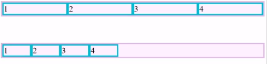

# Curso de GRID layout
## ¿Qué es CSS Grid Layout?

Css grid es una especificación de CSS para realizar layouts más dinámicos. Anteriormente sólo se podía usar tablas para realizar lo que ahora podemos hacer con Grid de manera mucho más sencilla. Nos permite dividir una página en áreas o regiones principales, por definir la relación en términos de tamaño, posición y capas construidas a partir de HTML

CSS Grid introdujo un sistema de grilla que es una cuadrícula con columnas (columns) y filas (rows), con ellas podemos ubicar elementos de manera más fácil.

Podemos crear, por ejemplo, un layout simple con el header, main y footer ya que cada bloque conforma un elemento de la grilla que se puede ubicar. Como los layouts pueden cambiar mucho, Grid nos ayuda a posicionar y reposicionar los elementos cuantas veces necesitemos.

<a href="https://css-tricks.com/snippets/css/complete-guide-grid/">La guía completa de CSS Grid.</a>

## Que es un... 

* Container: Es un contenedor donde se almacenan los elementos

* Item: Son los elementos que estan en el contenedor y se convierten en Grid Item pueden ser (botones,links,imagenes y videos)

* Lineas : Son los elementos que dividen las filas y columnas de una Grilla

* Celda: Es la unidad minima que tenemos en una Grilla, esta delimitada por 4 lineas. Ocupa 1 columna, 1 Fila

* Track: Los track son un grupo de celdas que estan en una misma fila o una misma columna

* Area: Pueden usar varias filas o varias columnas al mismo tiempo

## Propiedades del contenedor grid: 

* Display: Grid
* Grid-template
* Grid-auto
* Gaps

contenedor padre: 

    display: grid;

    grid-template-colums: indica cuantas columnas va a tener y de que ancho va a ser cada columna
    grid-template-rows: indica cuantas filas va a tener y de que altura va a ser cada fila

* Ejemplo, para crear 3 columnas (cada uno de diferentes

tamaño):

        grid-template-colums: 100px 200px 300px;

Nota: Si en tu contenedor hay 4 o más items, grid-template-columns te creará automáticamente 1 nueva fila y comenzará a llenarla, y pondrá cada fila en 3 columnas Además, también podemos colocar ambos tipos de grid-template
* Ejemplo:

        grid-template-columns: 100px 200px 300px;
        grid-template-rows: 150px 250px;

Otra forma de colocar los tamaños de las filas y columnas, sería
usar grid-auto
Esta propiedad define el tamaño de cualquier fila o columna que se crea.
Existe grid-auto-rows; grid-auto-columns; **grid-auto-flow**

* Ejemplo:
grid-auto-rows: 150px;
*Esto hara que todas tus filas siempre tenga una altura de 150px.*

* grid-auto-flow: Modifica cómo se está llenando nuestra grilla.

Por defecto está el row, ya que cuando los elementos no caben en lo que hemos definido, lo que hace es crear mas filas nuevas

* grid-auto-flow: dense; : Si hay un espacio vacío en la grilla, lo que va a hacer es poner los elementos allí, en vez de seguir poniéndolos en filas y columnas

        grid-auto-flow: column; :Crea nuevas columnas, en vez denuevas filas

* Para definir espacios entre filas y/o columnas
        
        row-gap: crea un espacio solo entre filas (no se crea un espacio entre una fila y el borde de su contenedor)

* column-gap: se crea un espacio solo entre sus columnas
* gap: una combinación entre row-gap y column-gap (crea un espacio entre filas y entre columnas con el mismo tamaño puesto en CSS)

## Propiedades para la alineación de los items (elementos):

* Justify-items
* Align-items
* Place-items

### Propiedades para la alineación del container(El Contenedor):

* Justify-content (start-center-end)
* Align-content   (start-center-end)
* Place-content   (start-center-end)

* Propiedades para la alineación de un solo item individual

* Justify-self   (start-center-end)
* Align-self     (start-center-end) 
* Place-self     (start-center-end)

## Propieades de ubicación (para las filas (rows))

* Grid-row-start:Donde empieza
* Grid-row-end:Donde termina
* Grid-row: Simplifica las el grid-start y end

### Grid-row

Definimos las 4 ubicaciones donde comienza y terminan las filas y columnas

Inicia en la row 2 y column 2 | termina en la 4 y 4

Grid-area: 2 /2 / 4 / 4;

### Grid-template-area: 

Es una manera mas sencilla de aplicar zonas para las areas de la grilla 

    <!-- por ejemplo definimos una grilla de 3 por 3 -->
    grid-template-rows:1fr 1fr 1fr;
    grid-template-columns:1fr 1fr 1fr;
    grid-template-areas: "header header header" <!-- Definimos los espacios para la grilla de 3x3 -->
                         "aside main main"
                         "footer footer footer";
    //Lo asignamos 

    .item1{
    background-color: aqua;
    grid-area: header;
    }
    .item2{
        background-color: rgb(187, 84, 187);
        grid-area: main;
    }
    .item3{
        background-color: rgb(225, 157, 20);
        grid-area: aside;

    }
    .item4{
        background-color: rgb(225, 92, 20);
        grid-area: footer;

    }

## Funciones especiales

* minmax: ayuda a declarar el tamaño minimo y maximo para el ancho y alto de una celda, sin depender del contenido que tengamos en ella

* repeat : se usa cuando todas las columnas o filas tienen el msmo ancho y evitar repetir el tamaño de las columnas##

        .container{
        
        background-color: antiquewhite;
        border: solid blue 1px;
        display:grid;
        grid-template-columns: minmax(30px,300px) minmax(30px,200px) minmax(60px,300px);//Le decimos que tenemos 3 columnas que tendran un minimo y un maximo de tamaño pero para garatizarlo debemos definir el tamaño de las filas(rows) a auto
        grid-template-rows:repeat(3,auto);
        grid-template-areas: "header header header"
                            "aside main main"
                            "footer footer footer";
        }
    
## KEYWORDS ESPECIALES

* fr : Es una unidad de medida especial de css grid para darle ancho o alto a filas y columnas 1fr representa una fraccion del total de columnas o filas.

* min-content : Ajusta el ancho de la celda lo mínimo posible sin romper su contenido.

* max-content : Ajusta el ancho de la celda lo máximo posible para mostrar su contenido.

* auto-fill : Agrega columnas “fantasma” que rellenan el espacio sobrante del contenedor.

* auto-fit : Ensancha las columnas para que ocupen todo el espacio del contenedor.

auto-fit y auto-fill ayudan a la grilla a ocupar el 100% del espacio disponible.

   

